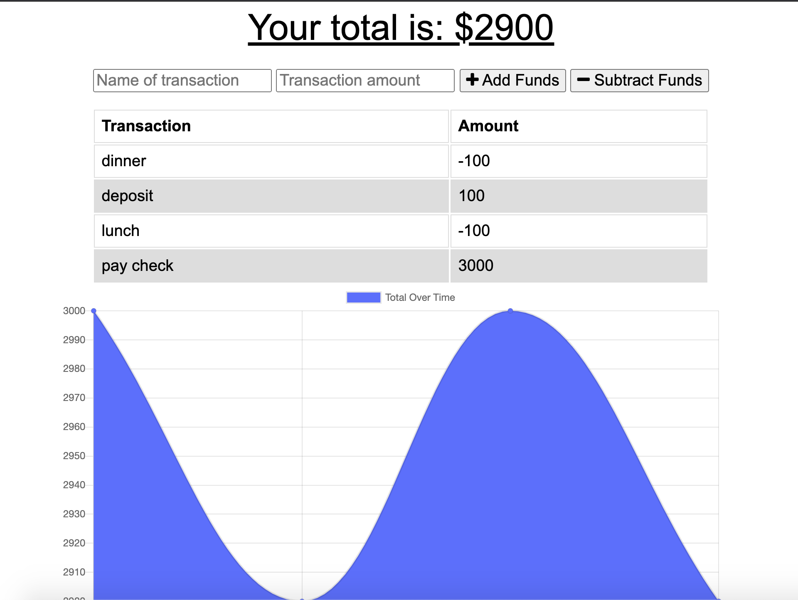

# budget_pwa

## Description
The user will be able to add expenses and deposits to their budget with or without a connection. A user will also be able to download the app since it is a progressive web app. 

## Check out the App here!:
https://tracking-budget-pwa.herokuapp.com/

## User Story
AS a frequent traveller I WANT to be able to track my withdrawals and deposits with or without a data/internet connection SO THAT my account balance is accurate when I am traveling

## Business Context
Giving users a fast and easy way to track their money is important, but allowing them to access that information anytime is even more important. Having offline functionality is paramount to our applications success.

## Table_of_Contents 

* [General_Info](#General_Info)
* [Functionality](#Functionality)
* [Technologies](#Technologies)
* [Final_Result](#FinalResult)
* [Github_Links](#Github_Links)

## General_Info
<b>What is Progressive Web Application (PWA)?</b>
* A Progressive Web App (PWA) is a web app that uses modern web capabilities to deliver an app-like experience to users. These apps meet certain requirements (see below), are deployed to servers, accessible through URLs, and indexed by search engines.
<b>What is required for PWA?</b>
To be considered a Progressive Web App, your app must be:

* Progressive - Work for every user, regardless of browser choice, because they are built with progressive enhancement as a core tenet.
* Responsive - Fit any form factor, desktop, mobile, tablet, or whatever is next.

* Connectivity independent - Enhanced with service workers to work offline or on low quality networks.

* App-like - Use the app-shell model to provide app-style navigation and interactions.

* Fresh - Always up-to-date thanks to the service worker update process.

* Safe - Served via HTTPS to prevent snooping and ensure content has not been tampered with.

* Discoverable - Are identifiable as “applications” thanks to W3C manifests and service worker registration scope allowing search engines to find them.

* Re-engageable - Make re-engagement easy through features like push notifications.

* Installable - Allow users to “keep” apps they find most useful on their home screen without the hassle of an app store.

* Linkable - Easily share via URL and not require complex installation.

<b>Offline Support</b>
* Apps should be able to work offline. Whether that be displaying a proper "offline" message or caching app data for display purpose.

### Functionality
BUDGET-TRACKER Offline Functionality:

* Enter deposits offline
* Enter expenses offline
When brought back online:

* Offline entries should be added to tracker.

### Technologies 
1. HTML
2. CSS
3. Bootstrap
4. JavaScript
5. Node.js
6. Express
7. MongoDB
8. Mongoose

## Final_Result
### ScreenShots

## Github_Links
[**URL of My Github Repository**](https://github.com/guptaria/budget_pwa)

